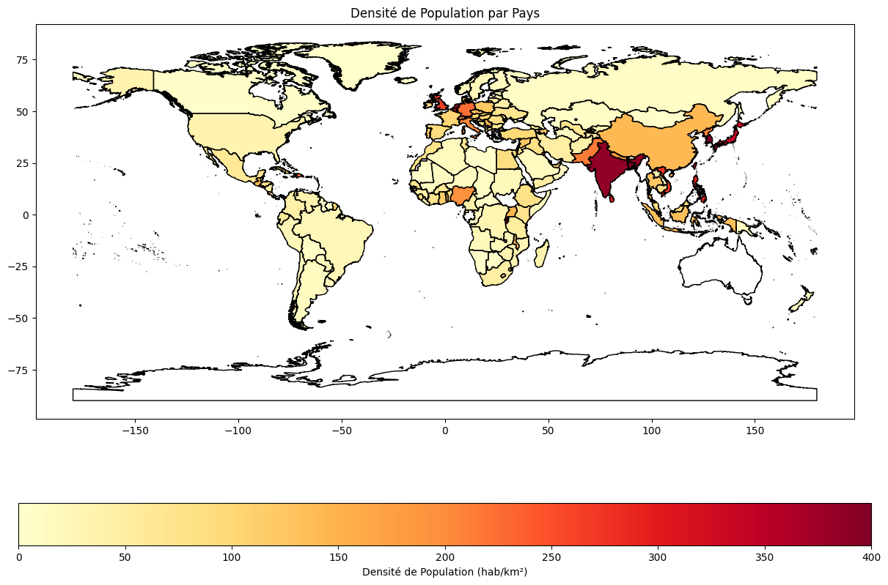

```python
import pandas as pd
import numpy as np
import matplotlib.pyplot as plt
import geopandas as gpd
import geodatasets
```


```python
villes=pd.read_csv("cities.csv")
pays=pd.read_csv("countries.csv")
temps=pd.read_csv("daily-weather-cities.csv")
```


```python
print(villes,pays,temps) #regardons ce que contiennent nos bases de données
temps.describe()
```

         station_id    city_name      country       state iso2 iso3   latitude  \
    0         41515     Asadabad  Afghanistan       Kunar   AF  AFG  34.866000   
    1         38954     Fayzabad  Afghanistan  Badakhshan   AF  AFG  37.129761   
    2         41560    Jalalabad  Afghanistan   Nangarhar   AF  AFG  34.441527   
    3         38947       Kunduz  Afghanistan      Kunduz   AF  AFG  36.727951   
    4         38987   Qala i Naw  Afghanistan     Badghis   AF  AFG  34.983000   
    ...         ...          ...          ...         ...  ...  ...        ...   
    1240      67475       Kasama       Zambia    Northern   ZM  ZMB -10.199598   
    1241      68030  Livingstone       Zambia    Southern   ZM  ZMB -17.860009   
    1242      67633        Mongu       Zambia     Western   ZM  ZMB -15.279598   
    1243      67775       Harare     Zimbabwe      Harare   ZW  ZWE -17.817790   
    1244      67975     Masvingo     Zimbabwe    Masvingo   ZW  ZWE -20.059617   
    
          longitude  
    0     71.150005  
    1     70.579247  
    2     70.436103  
    3     68.872530  
    4     63.133300  
    ...         ...  
    1240  31.179947  
    1241  25.860013  
    1242  23.120025  
    1243  31.044709  
    1244  30.820020  
    
    [1245 rows x 8 columns]                country       native_name iso2 iso3  population       area  \
    0          Afghanistan         افغانستان   AF  AFG  26023100.0   652230.0   
    1              Albania         Shqipëria   AL  ALB   2895947.0    28748.0   
    2              Algeria           الجزائر   DZ  DZA  38700000.0  2381741.0   
    3       American Samoa    American Samoa   AS  ASM     55519.0      199.0   
    4               Angola            Angola   AO  AGO  24383301.0  1246700.0   
    ..                 ...               ...  ...  ...         ...        ...   
    209  Wallis and Futuna  Wallis et Futuna   WF  WLF     13135.0      142.0   
    210     Western Sahara   الصحراء الغربية   EH  ESH    586000.0   266000.0   
    211              Yemen           اليَمَن   YE  YEM  25956000.0   527968.0   
    212             Zambia            Zambia   ZM  ZMB  15023315.0   752612.0   
    213           Zimbabwe          Zimbabwe   ZW  ZWE  13061239.0   390757.0   
    
           capital  capital_lat  capital_lng                     region continent  
    0        Kabul    34.526011    69.177684  Southern and Central Asia      Asia  
    1       Tirana    41.326873    19.818791            Southern Europe    Europe  
    2      Algiers    36.775361     3.060188            Northern Africa    Africa  
    3    Pago Pago   -14.275479  -170.704830                  Polynesia   Oceania  
    4       Luanda    -8.827270    13.243951             Central Africa    Africa  
    ..         ...          ...          ...                        ...       ...  
    209   Mata-Utu   -13.282042  -176.174022                  Polynesia   Oceania  
    210   El Aaiún    27.154512   -13.195392            Northern Africa    Africa  
    211     Sana'a    15.353857    44.205884                Middle East      Asia  
    212     Lusaka   -15.416449    28.282154             Eastern Africa    Europe  
    213     Harare   -17.831773    31.045686             Eastern Africa    Africa  
    
    [214 rows x 11 columns]         station_id city_name        date  season  avg_temp_c  min_temp_c  \
    0            11035    Vienna  1855-02-01  Winter         NaN        -8.5   
    1            11035    Vienna  1855-02-02  Winter         NaN       -12.1   
    2            11035    Vienna  1855-02-03  Winter         NaN       -17.5   
    3            11035    Vienna  1855-02-04  Winter         NaN       -11.4   
    4            11035    Vienna  1855-02-05  Winter         NaN        -7.5   
    ...            ...       ...         ...     ...         ...         ...   
    193114       10384    Berlin  2023-08-30  Summer        15.6        11.9   
    193115       10384    Berlin  2023-08-31  Summer        16.2        12.0   
    193116       10384    Berlin  2023-09-01  Autumn        16.7        12.2   
    193117       10384    Berlin  2023-09-02  Autumn        17.6        13.3   
    193118       10384    Berlin  2023-09-03  Autumn        18.5        13.5   
    
            max_temp_c  precipitation_mm  snow_depth_mm  avg_wind_dir_deg  \
    0             -4.0               NaN            NaN               NaN   
    1             -3.8               NaN            NaN               NaN   
    2             -8.3               NaN            NaN               NaN   
    3             -6.3               NaN            NaN               NaN   
    4             -1.3               NaN            NaN               NaN   
    ...            ...               ...            ...               ...   
    193114        19.7               NaN            NaN             239.0   
    193115        21.1               NaN            NaN             203.0   
    193116        21.7               NaN            NaN             190.0   
    193117        22.5               NaN            NaN             226.0   
    193118        23.9               NaN            NaN             190.0   
    
            avg_wind_speed_kmh  peak_wind_gust_kmh  avg_sea_level_pres_hpa  \
    0                      NaN                 NaN                     NaN   
    1                      NaN                 NaN                     NaN   
    2                      NaN                 NaN                     NaN   
    3                      NaN                 NaN                     NaN   
    4                      NaN                 NaN                     NaN   
    ...                    ...                 ...                     ...   
    193114                 9.8                24.1                  1010.8   
    193115                10.4                25.9                  1012.1   
    193116                11.0                27.8                  1015.5   
    193117                11.7                27.8                  1017.5   
    193118                11.5                27.8                  1017.6   
    
            sunshine_total_min  
    0                      NaN  
    1                      NaN  
    2                      NaN  
    3                      NaN  
    4                      NaN  
    ...                    ...  
    193114                 NaN  
    193115                 NaN  
    193116                 NaN  
    193117                 NaN  
    193118                 NaN  
    
    [193119 rows x 14 columns]
    


<div>
<style scoped>
    .dataframe tbody tr th:only-of-type {
        vertical-align: middle;
    }

    .dataframe tbody tr th {
        vertical-align: top;
    }

    .dataframe thead th {
        text-align: right;
    }
</style>
<table border="1" class="dataframe">
  <thead>
    <tr style="text-align: right;">
      <th></th>
      <th>station_id</th>
      <th>avg_temp_c</th>
      <th>min_temp_c</th>
      <th>max_temp_c</th>
      <th>precipitation_mm</th>
      <th>snow_depth_mm</th>
      <th>avg_wind_dir_deg</th>
      <th>avg_wind_speed_kmh</th>
      <th>peak_wind_gust_kmh</th>
      <th>avg_sea_level_pres_hpa</th>
      <th>sunshine_total_min</th>
    </tr>
  </thead>
  <tbody>
    <tr>
      <th>count</th>
      <td>193119.000000</td>
      <td>94672.000000</td>
      <td>191314.000000</td>
      <td>191598.000000</td>
      <td>152546.000000</td>
      <td>55013.000000</td>
      <td>42054.000000</td>
      <td>45853.000000</td>
      <td>21784.000000</td>
      <td>42547.000000</td>
      <td>18925.000000</td>
    </tr>
    <tr>
      <th>mean</th>
      <td>8674.711235</td>
      <td>10.622556</td>
      <td>6.348172</td>
      <td>14.231167</td>
      <td>1.888934</td>
      <td>10.943831</td>
      <td>193.547891</td>
      <td>13.716361</td>
      <td>38.936683</td>
      <td>1015.981143</td>
      <td>280.843382</td>
    </tr>
    <tr>
      <th>std</th>
      <td>2098.969159</td>
      <td>7.485526</td>
      <td>6.691068</td>
      <td>8.601553</td>
      <td>4.373271</td>
      <td>44.779003</td>
      <td>95.058097</td>
      <td>5.921333</td>
      <td>14.362104</td>
      <td>9.133276</td>
      <td>265.674706</td>
    </tr>
    <tr>
      <th>min</th>
      <td>6447.000000</td>
      <td>-18.500000</td>
      <td>-26.000000</td>
      <td>-17.600000</td>
      <td>0.000000</td>
      <td>0.000000</td>
      <td>0.000000</td>
      <td>0.000000</td>
      <td>7.600000</td>
      <td>967.800000</td>
      <td>0.000000</td>
    </tr>
    <tr>
      <th>25%</th>
      <td>6447.000000</td>
      <td>5.100000</td>
      <td>1.500000</td>
      <td>7.700000</td>
      <td>0.000000</td>
      <td>0.000000</td>
      <td>112.000000</td>
      <td>9.400000</td>
      <td>28.800000</td>
      <td>1010.500000</td>
      <td>18.000000</td>
    </tr>
    <tr>
      <th>50%</th>
      <td>7149.000000</td>
      <td>10.800000</td>
      <td>6.700000</td>
      <td>14.500000</td>
      <td>0.000000</td>
      <td>0.000000</td>
      <td>214.000000</td>
      <td>12.800000</td>
      <td>36.700000</td>
      <td>1016.300000</td>
      <td>222.000000</td>
    </tr>
    <tr>
      <th>75%</th>
      <td>11035.000000</td>
      <td>16.500000</td>
      <td>11.700000</td>
      <td>21.000000</td>
      <td>1.800000</td>
      <td>0.000000</td>
      <td>268.000000</td>
      <td>17.000000</td>
      <td>46.400000</td>
      <td>1021.800000</td>
      <td>480.000000</td>
    </tr>
    <tr>
      <th>max</th>
      <td>11035.000000</td>
      <td>33.400000</td>
      <td>25.300000</td>
      <td>41.900000</td>
      <td>119.500000</td>
      <td>2329.000000</td>
      <td>360.000000</td>
      <td>52.200000</td>
      <td>129.600000</td>
      <td>1048.500000</td>
      <td>978.000000</td>
    </tr>
  </tbody>
</table>
</div>


```python
gdf = gpd.read_file('ne_10m_admin_0_countries.shp') #geodataframe nous permettant d'afficher nos données sur des cartes du monde
```


```python
gdf.head()
```


<div>
<style scoped>
    .dataframe tbody tr th:only-of-type {
        vertical-align: middle;
    }

    .dataframe tbody tr th {
        vertical-align: top;
    }

    .dataframe thead th {
        text-align: right;
    }
</style>
<table border="1" class="dataframe">
  <thead>
    <tr style="text-align: right;">
      <th></th>
      <th>featurecla</th>
      <th>scalerank</th>
      <th>LABELRANK</th>
      <th>SOVEREIGNT</th>
      <th>SOV_A3</th>
      <th>ADM0_DIF</th>
      <th>LEVEL</th>
      <th>TYPE</th>
      <th>TLC</th>
      <th>ADMIN</th>
      <th>...</th>
      <th>FCLASS_TR</th>
      <th>FCLASS_ID</th>
      <th>FCLASS_PL</th>
      <th>FCLASS_GR</th>
      <th>FCLASS_IT</th>
      <th>FCLASS_NL</th>
      <th>FCLASS_SE</th>
      <th>FCLASS_BD</th>
      <th>FCLASS_UA</th>
      <th>geometry</th>
    </tr>
  </thead>
  <tbody>
    <tr>
      <th>0</th>
      <td>Admin-0 country</td>
      <td>0</td>
      <td>2</td>
      <td>Indonesia</td>
      <td>IDN</td>
      <td>0</td>
      <td>2</td>
      <td>Sovereign country</td>
      <td>1</td>
      <td>Indonesia</td>
      <td>...</td>
      <td>None</td>
      <td>None</td>
      <td>None</td>
      <td>None</td>
      <td>None</td>
      <td>None</td>
      <td>None</td>
      <td>None</td>
      <td>None</td>
      <td>MULTIPOLYGON (((117.70361 4.16341, 117.70361 4...</td>
    </tr>
    <tr>
      <th>1</th>
      <td>Admin-0 country</td>
      <td>0</td>
      <td>3</td>
      <td>Malaysia</td>
      <td>MYS</td>
      <td>0</td>
      <td>2</td>
      <td>Sovereign country</td>
      <td>1</td>
      <td>Malaysia</td>
      <td>...</td>
      <td>None</td>
      <td>None</td>
      <td>None</td>
      <td>None</td>
      <td>None</td>
      <td>None</td>
      <td>None</td>
      <td>None</td>
      <td>None</td>
      <td>MULTIPOLYGON (((117.70361 4.16341, 117.69711 4...</td>
    </tr>
    <tr>
      <th>2</th>
      <td>Admin-0 country</td>
      <td>0</td>
      <td>2</td>
      <td>Chile</td>
      <td>CHL</td>
      <td>0</td>
      <td>2</td>
      <td>Sovereign country</td>
      <td>1</td>
      <td>Chile</td>
      <td>...</td>
      <td>None</td>
      <td>None</td>
      <td>None</td>
      <td>None</td>
      <td>None</td>
      <td>None</td>
      <td>None</td>
      <td>None</td>
      <td>None</td>
      <td>MULTIPOLYGON (((-69.51009 -17.50659, -69.50611...</td>
    </tr>
    <tr>
      <th>3</th>
      <td>Admin-0 country</td>
      <td>0</td>
      <td>3</td>
      <td>Bolivia</td>
      <td>BOL</td>
      <td>0</td>
      <td>2</td>
      <td>Sovereign country</td>
      <td>1</td>
      <td>Bolivia</td>
      <td>...</td>
      <td>None</td>
      <td>None</td>
      <td>None</td>
      <td>None</td>
      <td>None</td>
      <td>None</td>
      <td>None</td>
      <td>None</td>
      <td>None</td>
      <td>POLYGON ((-69.51009 -17.50659, -69.51009 -17.5...</td>
    </tr>
    <tr>
      <th>4</th>
      <td>Admin-0 country</td>
      <td>0</td>
      <td>2</td>
      <td>Peru</td>
      <td>PER</td>
      <td>0</td>
      <td>2</td>
      <td>Sovereign country</td>
      <td>1</td>
      <td>Peru</td>
      <td>...</td>
      <td>None</td>
      <td>None</td>
      <td>None</td>
      <td>None</td>
      <td>None</td>
      <td>None</td>
      <td>None</td>
      <td>None</td>
      <td>None</td>
      <td>MULTIPOLYGON (((-69.51009 -17.50659, -69.63832...</td>
    </tr>
  </tbody>
</table>
<p>5 rows × 169 columns</p>
</div>


```python
tab = gdf.merge(pays, how="left", left_on="ADM0_A3", right_on="iso3") #création d'une table pour faire des cartes
```


```python
tab['densite_population'] = tab['population'] / tab['area'] #ajout d'une colonne pour la densité de population

```


```python
tab.head()
```


<div>
<style scoped>
    .dataframe tbody tr th:only-of-type {
        vertical-align: middle;
    }

    .dataframe tbody tr th {
        vertical-align: top;
    }

    .dataframe thead th {
        text-align: right;
    }
</style>
<table border="1" class="dataframe">
  <thead>
    <tr style="text-align: right;">
      <th></th>
      <th>featurecla</th>
      <th>scalerank</th>
      <th>LABELRANK</th>
      <th>SOVEREIGNT</th>
      <th>SOV_A3</th>
      <th>ADM0_DIF</th>
      <th>LEVEL</th>
      <th>TYPE</th>
      <th>TLC</th>
      <th>ADMIN</th>
      <th>...</th>
      <th>iso2</th>
      <th>iso3</th>
      <th>population</th>
      <th>area</th>
      <th>capital</th>
      <th>capital_lat</th>
      <th>capital_lng</th>
      <th>region</th>
      <th>continent</th>
      <th>densite_population</th>
    </tr>
  </thead>
  <tbody>
    <tr>
      <th>0</th>
      <td>Admin-0 country</td>
      <td>0</td>
      <td>2</td>
      <td>Indonesia</td>
      <td>IDN</td>
      <td>0</td>
      <td>2</td>
      <td>Sovereign country</td>
      <td>1</td>
      <td>Indonesia</td>
      <td>...</td>
      <td>ID</td>
      <td>IDN</td>
      <td>252164800.0</td>
      <td>1904569.0</td>
      <td>Jakarta</td>
      <td>-6.175394</td>
      <td>106.827183</td>
      <td>Southeast Asia</td>
      <td>Asia</td>
      <td>132.399929</td>
    </tr>
    <tr>
      <th>1</th>
      <td>Admin-0 country</td>
      <td>0</td>
      <td>3</td>
      <td>Malaysia</td>
      <td>MYS</td>
      <td>0</td>
      <td>2</td>
      <td>Sovereign country</td>
      <td>1</td>
      <td>Malaysia</td>
      <td>...</td>
      <td>MY</td>
      <td>MYS</td>
      <td>30430500.0</td>
      <td>330803.0</td>
      <td>Kuala Lumpur</td>
      <td>3.151696</td>
      <td>101.694237</td>
      <td>Southeast Asia</td>
      <td>Asia</td>
      <td>91.989795</td>
    </tr>
    <tr>
      <th>2</th>
      <td>Admin-0 country</td>
      <td>0</td>
      <td>2</td>
      <td>Chile</td>
      <td>CHL</td>
      <td>0</td>
      <td>2</td>
      <td>Sovereign country</td>
      <td>1</td>
      <td>Chile</td>
      <td>...</td>
      <td>CL</td>
      <td>CHL</td>
      <td>17819054.0</td>
      <td>756102.0</td>
      <td>Santiago</td>
      <td>9.869479</td>
      <td>-83.798075</td>
      <td>South America</td>
      <td>South America</td>
      <td>23.566998</td>
    </tr>
    <tr>
      <th>3</th>
      <td>Admin-0 country</td>
      <td>0</td>
      <td>3</td>
      <td>Bolivia</td>
      <td>BOL</td>
      <td>0</td>
      <td>2</td>
      <td>Sovereign country</td>
      <td>1</td>
      <td>Bolivia</td>
      <td>...</td>
      <td>BO</td>
      <td>BOL</td>
      <td>10027254.0</td>
      <td>1098581.0</td>
      <td>Sucre</td>
      <td>-19.047725</td>
      <td>-65.259431</td>
      <td>South America</td>
      <td>South America</td>
      <td>9.127460</td>
    </tr>
    <tr>
      <th>4</th>
      <td>Admin-0 country</td>
      <td>0</td>
      <td>2</td>
      <td>Peru</td>
      <td>PER</td>
      <td>0</td>
      <td>2</td>
      <td>Sovereign country</td>
      <td>1</td>
      <td>Peru</td>
      <td>...</td>
      <td>PE</td>
      <td>PER</td>
      <td>30814175.0</td>
      <td>1285216.0</td>
      <td>Lima</td>
      <td>-12.062106</td>
      <td>-77.036526</td>
      <td>South America</td>
      <td>South America</td>
      <td>23.975873</td>
    </tr>
  </tbody>
</table>
<p>5 rows × 181 columns</p>
</div>


```python
tab['densite_population'].max()
tab.loc[tab['densite_population'].idxmax()] #on voit ici que Monaco(mais aussi certaines autres villes) a une densité très importante donc on fera l'échelle nous meme sur la carte npour avoir quelque chose d'intéressant
```


    featurecla            Admin-0 country
    scalerank                           0
    LABELRANK                           4
    SOVEREIGNT                      China
    SOV_A3                            CH1
                               ...       
    capital_lat                       NaN
    capital_lng                       NaN
    region                   Eastern Asia
    continent                        Asia
    densite_population       21033.333333
    Name: 254, Length: 181, dtype: object


```python
# Tracer la carte avec la densité de population
fig, ax = plt.subplots(1, 1, figsize=(15, 10))
tab.boundary.plot(ax=ax, linewidth=1, color="k")  # Tracer les frontières des pays
tab.plot(column='densite_population', ax=ax, legend=True,
         legend_kwds={'label': "Densité de Population (hab/km²)",
                      'orientation': "horizontal"},
         cmap='YlOrRd',
            vmin=0, vmax=400)  # colormap  Yellow-Orange-Red

# Titre et ajustement de la mise en page
plt.title('Densité de Population par Pays')
plt.show()
```


    

    


```python
meteo= tab.merge(villes, how="left", left_on="iso3", right_on="iso3")
```


```python
meteo = meteo.merge(temps, how="left", left_on="city_name", right_on="city_name") #regroupons tous les tableaux
meteo.head()
```


<div>
<style scoped>
    .dataframe tbody tr th:only-of-type {
        vertical-align: middle;
    }

    .dataframe tbody tr th {
        vertical-align: top;
    }

    .dataframe thead th {
        text-align: right;
    }
</style>
<table border="1" class="dataframe">
  <thead>
    <tr style="text-align: right;">
      <th></th>
      <th>featurecla</th>
      <th>scalerank</th>
      <th>LABELRANK</th>
      <th>SOVEREIGNT</th>
      <th>SOV_A3</th>
      <th>ADM0_DIF</th>
      <th>LEVEL</th>
      <th>TYPE</th>
      <th>TLC</th>
      <th>ADMIN</th>
      <th>...</th>
      <th>avg_temp_c</th>
      <th>min_temp_c</th>
      <th>max_temp_c</th>
      <th>precipitation_mm</th>
      <th>snow_depth_mm</th>
      <th>avg_wind_dir_deg</th>
      <th>avg_wind_speed_kmh</th>
      <th>peak_wind_gust_kmh</th>
      <th>avg_sea_level_pres_hpa</th>
      <th>sunshine_total_min</th>
    </tr>
  </thead>
  <tbody>
    <tr>
      <th>0</th>
      <td>Admin-0 country</td>
      <td>0</td>
      <td>2</td>
      <td>Indonesia</td>
      <td>IDN</td>
      <td>0</td>
      <td>2</td>
      <td>Sovereign country</td>
      <td>1</td>
      <td>Indonesia</td>
      <td>...</td>
      <td>NaN</td>
      <td>NaN</td>
      <td>NaN</td>
      <td>NaN</td>
      <td>NaN</td>
      <td>NaN</td>
      <td>NaN</td>
      <td>NaN</td>
      <td>NaN</td>
      <td>NaN</td>
    </tr>
    <tr>
      <th>1</th>
      <td>Admin-0 country</td>
      <td>0</td>
      <td>2</td>
      <td>Indonesia</td>
      <td>IDN</td>
      <td>0</td>
      <td>2</td>
      <td>Sovereign country</td>
      <td>1</td>
      <td>Indonesia</td>
      <td>...</td>
      <td>NaN</td>
      <td>NaN</td>
      <td>NaN</td>
      <td>NaN</td>
      <td>NaN</td>
      <td>NaN</td>
      <td>NaN</td>
      <td>NaN</td>
      <td>NaN</td>
      <td>NaN</td>
    </tr>
    <tr>
      <th>2</th>
      <td>Admin-0 country</td>
      <td>0</td>
      <td>2</td>
      <td>Indonesia</td>
      <td>IDN</td>
      <td>0</td>
      <td>2</td>
      <td>Sovereign country</td>
      <td>1</td>
      <td>Indonesia</td>
      <td>...</td>
      <td>NaN</td>
      <td>NaN</td>
      <td>NaN</td>
      <td>NaN</td>
      <td>NaN</td>
      <td>NaN</td>
      <td>NaN</td>
      <td>NaN</td>
      <td>NaN</td>
      <td>NaN</td>
    </tr>
    <tr>
      <th>3</th>
      <td>Admin-0 country</td>
      <td>0</td>
      <td>2</td>
      <td>Indonesia</td>
      <td>IDN</td>
      <td>0</td>
      <td>2</td>
      <td>Sovereign country</td>
      <td>1</td>
      <td>Indonesia</td>
      <td>...</td>
      <td>NaN</td>
      <td>NaN</td>
      <td>NaN</td>
      <td>NaN</td>
      <td>NaN</td>
      <td>NaN</td>
      <td>NaN</td>
      <td>NaN</td>
      <td>NaN</td>
      <td>NaN</td>
    </tr>
    <tr>
      <th>4</th>
      <td>Admin-0 country</td>
      <td>0</td>
      <td>2</td>
      <td>Indonesia</td>
      <td>IDN</td>
      <td>0</td>
      <td>2</td>
      <td>Sovereign country</td>
      <td>1</td>
      <td>Indonesia</td>
      <td>...</td>
      <td>NaN</td>
      <td>NaN</td>
      <td>NaN</td>
      <td>NaN</td>
      <td>NaN</td>
      <td>NaN</td>
      <td>NaN</td>
      <td>NaN</td>
      <td>NaN</td>
      <td>NaN</td>
    </tr>
  </tbody>
</table>
<p>5 rows × 201 columns</p>
</div>


```python
meteo = meteo.dropna(subset=["avg_temp_c",  "min_temp_c", "max_temp_c","precipitation_mm",  "snow_depth_mm" ,"avg_wind_dir_deg" ,"avg_wind_speed_kmh","peak_wind_gust_kmh", "avg_sea_level_pres_hpa", "sunshine_total_min"], how='all')#supprimons les lignes inutiles
```


```python
temperature_moyenne = meteo.groupby('iso3')['avg_temp_c'].mean().reset_index() #on calcule la dataframe contenant les valeurs moyennes de la temperature dans chaque pays par jour depuis 1855(en faisant la moyenne sur les villes données

print(temperature_moyenne)
temperature = gdf.merge(temperature_moyenne, how="left", left_on="ADM0_A3", right_on="iso3") #on fait le tableau pour y tracer
```

      iso3  avg_temp_c
    0  AUT   10.750403
    1  BEL   10.699769
    2  DEU    9.854758
    3  FRA   11.539026
    


```python
fig, ax = plt.subplots(1, 1, figsize=(15, 10))
temperature.boundary.plot(ax=ax, linewidth=1, color="k")  # Tracer les frontières des pays
temperature.plot(column='avg_temp_c', ax=ax, legend=True,
         legend_kwds={'label': "Température moyenne(°C)",
                      'orientation': "horizontal"},
         cmap='YlOrRd')  #  colormap Yellow-Orange-Red

# Titre et ajustement de la mise en page
plt.title('Température moyenne par Pays depuis 1855')
plt.show()
```


    

    


```python
pd.Series.unique(temps['city_name']) #On remarque qu'on a (malgré toutes les villes dans le tableau de villes) uniquement des données métérologiques pour 4 villes, la carte du monde est donc finalement peu utile...
#On a de plus les valeurs uniquement des capitales
```


    array(['Vienna', 'Brussels', 'Paris', 'Berlin'], dtype=object)


```python
fig, ax = plt.subplots(1, 1, figsize=(15, 10))
temperature.boundary.plot(ax=ax, linewidth=1, color="k")  # Tracer les frontières des pays
temperature.plot(column='avg_temp_c', ax=ax, legend=True,
         legend_kwds={'label': "Température moyenne(°C)",
                      'orientation': "horizontal"},
         cmap='YlOrRd')  # colormap Yellow-Orange-Red
ax.set_xlim(-5, 17)  # Limites de longitude pour les pays
ax.set_ylim(42, 55)  # Limites de latitude pour les pays

plt.title('Température moyenne par capitale de ces Pays depuis 1855')
plt.show()
```


    

    


```python
precipitation_moyenne = meteo.groupby('iso3')['precipitation_mm'].mean().reset_index() #on calcule la dataframe contenant les valeurs moyennes de la precipitation dans chaque pays(en faisant la moyenne sur les villes données

precipitation = gdf.merge(precipitation_moyenne, how="left", left_on="ADM0_A3", right_on="iso3") #on fait le tableau pour y tracer
```


```python
fig, ax = plt.subplots(1, 1, figsize=(15, 10))
precipitation.boundary.plot(ax=ax, linewidth=1, color="k")  # Tracer les frontières des pays
precipitation.plot(column='precipitation_mm', ax=ax, legend=True,
         legend_kwds={'label': "Précipitation moyenne(mm)",
                      'orientation': "horizontal"},
         cmap='Blues')  # colormap bleue pour l'eau cette fois-ci

ax.set_xlim(-5, 17)  # Limites de longitude pour les pays
ax.set_ylim(42, 55)  # Limites de latitude pour les pays

plt.title('précipitation moyenne par capitale de ces pays depuis 1855')
plt.show()
```


    

    


```python
print(temps.dtypes ) #il va falloir convertir
```

    station_id                  int64
    city_name                  object
    date                       object
    season                     object
    avg_temp_c                float64
    min_temp_c                float64
    max_temp_c                float64
    precipitation_mm          float64
    snow_depth_mm             float64
    avg_wind_dir_deg          float64
    avg_wind_speed_kmh        float64
    peak_wind_gust_kmh        float64
    avg_sea_level_pres_hpa    float64
    sunshine_total_min        float64
    dtype: object
    


```python
meteo['date']=pd.to_datetime(meteo['date'])
meteo['Année'] = meteo['date'].dt.year    #trions les par an
temps_avg = meteo.groupby(['Année', 'city_name'])['avg_temp_c'].mean().reset_index()
```


```python
plt.figure(figsize=(12, 8))

# Tracer l'évolution de la température pour chaque ville
for ville in temps_avg['city_name'].unique():
    # Filtrer les données pour chaque ville
    df_ville = temps_avg[temps_avg['city_name'] == ville]
    
    # Tracer les données
    plt.plot(df_ville['Année'], df_ville['avg_temp_c'], label=ville)

# Ajouter des labels et un titre
plt.xlabel('Année')
plt.ylabel('Température Moyenne (°C)')
plt.title('Évolution des Températures Moyennes par Ville')
plt.legend(title='Ville')
plt.grid(True)

plt.show()
```


    

    


```python
#Il manque des données sur certaines villes donc affichons le uniquement pour Berlin
plt.figure(figsize=(12, 8))

# Tracer l'évolution de la température pour chaque ville
for ville in temps_avg['city_name'].unique():
    # Filtrer les données
    df_ville = temps_avg[temps_avg['city_name'] == 'Berlin']
    
    # Tracer les données
    plt.plot(df_ville['Année'], df_ville['avg_temp_c'])

# Ajouter des labels et un titre
plt.xlabel('Année')
plt.ylabel('Température Moyenne (°C)')
plt.title('Évolution des Températures Moyennes à Berlin')
plt.grid(True)

plt.show()

```


    

    


```python
#Faisons la même avec une moyenne glissante sur 10 ans
temps_avg['Température_Moyenne_Mobile'] = temps_avg.groupby('city_name')['avg_temp_c'].transform(lambda x: x.rolling(window=10, min_periods=1).mean())

plt.figure(figsize=(12, 8))

# Tracer l'évolution de la température pour chaque ville
for ville in temps_avg['city_name'].unique():
    # Filtrer les données pour chaque ville
    df_ville = temps_avg[temps_avg['city_name'] == 'Berlin']
    
    # Tracer les données
    plt.plot(df_ville['Année'], df_ville['Température_Moyenne_Mobile'])

# Ajouter des labels et un titre
plt.xlabel('Année')
plt.ylabel('Température Moyenne (°C)')
plt.title('Évolution des Températures Moyennes à Berlin')
plt.grid(True)

plt.show() #On remarque bien les effets du réchauffement climatique
```


    

    

